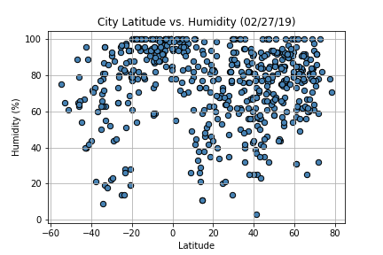

# WeatherPy APIs

Creating a Python script to visualize the weather of 500+ cities across the world of varying distance from the equator, utilizing python requests, JSON traversals, and the OpenWeatherMap API. A series of scatter plots were created to showcase the following relationships:

* Temperature (F) vs. Latitude

* Humidity (%) vs. Latitude

* Cloudiness (%) vs. Latitude

* Wind Speed (mph) vs. Latitude

### Observations from Analysis
* Temperatures tend to be warmer around the 0 degree latitude, as one would expect, though it is of note that cities in the northern hemisphere are experiencing even colder temperatures this time of the year than cities sampled from the southern hemisphere.
* There is no strong relationship between latitude and wind speed or latitude and cloudiness, however, it was interesting to note that both graphs were very different in their distribution. Windiness this time of year near the equator seems to stay relatively low, but cloudiness shows a lot of variance from 0 to 100% across all cities.
* Humidity also shows a lot of variance across data points, however, there does seem to be a more concentrated cluster of cities around the equator (0 deg. Latitude) that are above 70% humidity. This is likely due to the warmer temperatures allowing for more water vapor in the air.
